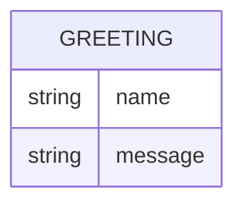

# Domain Model

Greeter has a single conceptual entity: the greeting it returns for a requested name.

`Greeting` is never persisted — it is computed per request from the `name` query parameter (or a default) and returned directly in the response.